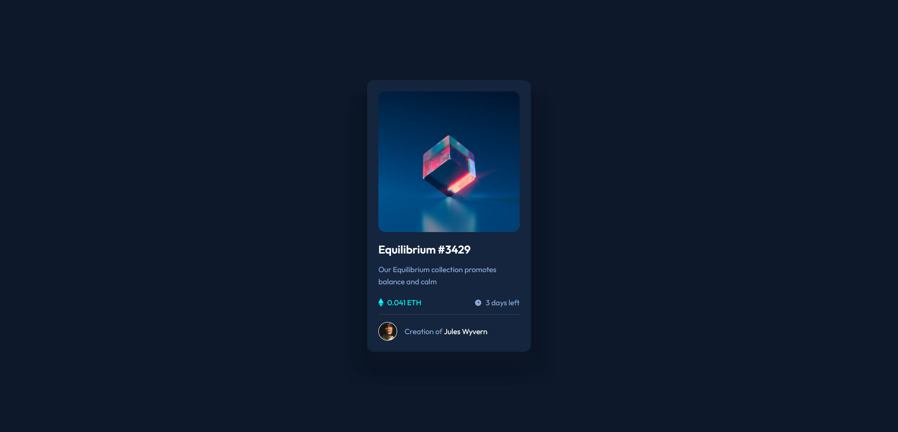

# Frontend Mentor - NFT preview card component solution

This is a solution to the [NFT preview card component challenge on Frontend Mentor](https://www.frontendmentor.io/challenges/nft-preview-card-component-SbdUL_w0U).
I know, I'm not suppose to add Sass folder in my repository, since it wouldn't be processed on the actual website page. but I included it just to share what I actually code for the styling for the web page. Thank you.

## Table of contents

- [Overview](#overview)
  - [The challenge](#the-challenge)
  - [Screenshot](#screenshot)
  - [Links](#links)
- [My process](#my-process)
  - [Built with](#built-with)
- [Author](#author)

## Overview

### The challenge

Users should be able to:

- View the optimal layout depending on their device's screen size
- See hover states for interactive elements

### Screenshot

### Links

- Solution URL: [solution URL here](https://github.com/Refara08/NFT-Card-Preview)
- Live Site URL: [live site URL here](https://silly-shirley-c60068.netlify.app)

## My process

### Built with

- Semantic HTML5 markup
- Sass
- CSS custom properties
- Flexbox
- CSS Grid

## Author

- Frontend Mentor - [@Refara08](https://www.frontendmentor.io/profile/Refara08)
- Github - [Refara08](https://github.com/Refara08)
- Codepen - [Gema Refantero](https://codepen.io/refantero)
